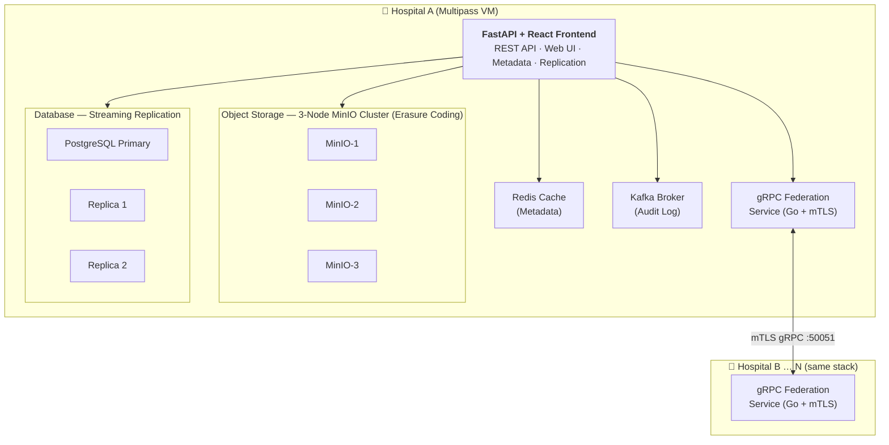

# Fault-Tolerant Medical Imaging Storage and Exchange Platform

A **federated, fault-tolerant medical imaging storage and exchange platform** that enables secure cross-facility data sharing between independent hospital facilities. Each facility operates its own storage cluster, database replicas, and caching layer; hospitals communicate over mutual TLS gRPC for consent-based file transfer — all compliant with the Kenya Data Protection Act (2019).

> **Course:** APT 3065 — Advanced Programming Techniques, Midterm Project  
> **Institution:** United States International University - Africa (USIU-Africa)  
> **Academic Year:** 2026

---

## Key Features

| Category | Highlights |
|----------|-----------|
| **Federation** | N-hospital mesh via Multipass VMs, Go gRPC sidecar with mTLS 1.3, peer exchange auto-discovery |
| **Fault Tolerance** | 3-node MinIO cluster (erasure coding), PostgreSQL primary + 2 streaming replicas, Redis cache |
| **Security** | JWT RS256 RBAC (admin / doctor / patient), patient consent grant/revoke, immutable Kafka audit log |
| **Frontend** | React 18 + TypeScript — Login, Dashboard, File Browser, Consent management |
| **Compliance** | Kenya DPA 2019 — data sovereignty, explicit consent, right to access/erasure |

---

## Architecture



Each facility runs **14 Docker services**: FastAPI, Go federation sidecar, 3× MinIO, PostgreSQL primary + 2 replicas, Redis, Kafka, Zookeeper, and Prometheus.

---

## Tech Stack

| Layer | Technology |
|-------|-----------|
| API | FastAPI (Python 3.11), 40+ REST endpoints, OpenAPI 3.1 |
| Federation | Go 1.22 gRPC service, Protocol Buffers 3, mTLS 1.3 |
| Storage | MinIO 3-node cluster per facility (S3-compatible, erasure coding) |
| Database | PostgreSQL 15 (primary + 2 streaming replicas) |
| Cache | Redis 7 (sub-100ms reads, 5-min TTL) |
| Messaging | Apache Kafka 7.0 (immutable audit log) |
| Auth | JWT RS256, bcrypt, RBAC (admin / doctor / patient) |
| Frontend | React 18, TypeScript 5, Vite 5, React Router v6 |
| Deployment | Multipass VMs, Docker Compose v2, PowerShell scripts |
| Monitoring | Prometheus + Grafana |

---

## Quick Start

### Prerequisites

- Windows 10/11 with **Hyper-V** enabled
- [Multipass](https://multipass.run) installed
- PowerShell 5.1+
- 8 GB RAM and 20 GB disk available

### Deploy two hospitals

```powershell
cd medimage-store-and-fed-share

# One command — generates certs, provisions VMs, starts all services
.\scripts\deploy.ps1 -Hospital "both" -Start
```

Wait ~2-3 minutes, then:

```powershell
multipass list                    # get VM IPs
.\scripts\access-hospitals.ps1   # shows URLs, optionally opens browser
```

| Endpoint | URL |
|----------|-----|
| Web UI | `http://<hospital-ip>:8000` |
| API Docs (Swagger) | `http://<hospital-ip>:8000/docs` |
| OHIF Local Viewer | `http://<hospital-ip>:8042/viewer` |
| MinIO Console | `http://<hospital-ip>:9001` |

**Default credentials** (seeded via `POST /api/auth/seed`):

| Role | Email | Password |
|------|-------|----------|
| Admin | `admin@<hospital-id>.local` | `admin123` |
| Doctor | `doctor@<hospital-id>.local` | `doctor123` |

### Add another hospital

```powershell
.\scripts\deploy.ps1 -Hospital "hospital-c" -Start
# Auto-discovers existing peers via peer exchange protocol
```

### Common operations

```powershell
# Health check all hospitals
.\scripts\check-hospitals.ps1

# Stop / restart services
multipass exec hospital-a -- bash -c "cd /home/ubuntu/medimage && docker compose down"
multipass exec hospital-a -- bash -c "cd /home/ubuntu/medimage && docker compose up -d"

# View logs
multipass exec hospital-a -- docker compose logs -f fastapi
```

---

## Project Layout

```
medimage-store-and-fed-share/
├── app/                    # FastAPI backend (Python)
│   ├── main.py             #   entry point, routes, CORS, metrics
│   ├── auth.py             #   JWT RS256, bcrypt, RBAC
│   ├── models.py           #   9 SQLAlchemy ORM tables
│   ├── minio_client.py     #   3-node MinIO operations
│   ├── replication_manager.py  # failover logic
│   ├── federation_client.py    # gRPC stub to Go sidecar
│   ├── kafka_client.py     #   audit event producer
│   ├── routers/            #   auth.py, consent.py
│   └── proto/              #   federation.proto + generated stubs
├── federation/             # Go gRPC federation service
│   ├── main.go
│   └── internal/server/    #   server.go, jwt.go, minio.go
├── frontend/src/           # React 18 + TypeScript
│   ├── pages/              #   Login, Signup, Dashboard, FileBrowser, Consent
│   ├── components/         #   Layout, ProtectedRoute
│   └── contexts/           #   AuthContext (JWT state)
├── scripts/                # 17 automation scripts (see scripts/README.md)
├── docker-compose.yml      # 14-service stack (per hospital)
├── prometheus.yml
└── docs/                   # Architecture, deployment, testing docs
```

---

## Documentation

| Document | Description |
|----------|-------------|
| **[docs/TECHNICAL-REFERENCE.md](docs/TECHNICAL-REFERENCE.md)** | Full API reference, configuration, test scenarios, troubleshooting, project structure |
| [docs/DEPLOYMENT.md](docs/DEPLOYMENT.md) | Step-by-step deployment guide |
| [docs/FEDERATION-ARCHITECTURE.md](docs/FEDERATION-ARCHITECTURE.md) | Federation topology and trust model |
| [docs/CA-ARCHITECTURE.md](docs/CA-ARCHITECTURE.md) | mTLS certificate authority design |
| [docs/ha-architecture.md](docs/ha-architecture.md) | High availability layer design |
| [docs/testing.md](docs/testing.md) | Manual test cases and curl examples |
| [scripts/README.md](scripts/README.md) | All 17 automation scripts documented |

---

## License

This project is created for educational purposes.

**Course:** APT 3065 — Advanced Programming Techniques (Midterm Project)  
**Institution:** United States International University - Africa (USIU-Africa)  
**Academic Year:** 2026
